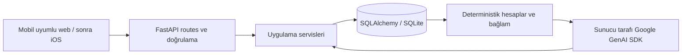

# NutriCoach mimari kararları

## Kapsam ve son MVP mimarisi

Bu belge tüm ürünün planıdır; mevcut kod Aşama 1, 2 ve 3'ü uygular. Gemini/sohbet veri sözleşmesi ve mevcut sınırlamalar [Aşama 3 rehberinde](phase3.md) açıklanır. Aşama 2'nin endpoint ve veri sözleşmeleri [kullanım rehberinde](phase2.md) açıklanır. Hedef MVP: yerelde tek kişinin kullanabildiği ama kullanıcıya bağlı veri modeli olan, doğal dilde öğün kaydı/düzeltmesi yapabilen, günlük özeti ve kalıcı bağlama sahip Türkçe koç sohbetini gösteren responsive web uygulaması.



Başlangıçta senkron SQLAlchemy oturumları ve normal `def` uçları yeterli. Basit veritabanı erişimini servislerde tutacağız; tekrar eden kullanıcı kapsamlı sorgular büyüdüğünde repository katmanı çıkaracağız. SQLite yerel, tek sunuculu kullanım için; PostgreSQL geçişinde bağlantı sürücüsü, migration'lar ve uyumluluk testleri gerekir. Sadece URL değiştirmek tüm geçişi tamamlamaz.

Arayüz aşamasında FastAPI'nin sunduğu Jinja2 HTML + küçük JavaScript modülleri ve CSS kullanacağız. JSON API bağımsız kalacak; böylece iOS istemcisi aynı servise bağlanabilecek. İlk aşamalarda ayrı Node/React derleme hattı gerekmiyor.

## Şema ve ilişkiler

| Varlık | Temel alanlar | İlişki / aşama |
|---|---|---|
| users | UUID id, name, nullable unique email, timezone, created_at | Şimdi |
| user_profiles | user_id PK/FK, birth_date, biological_sex, height_cm, goal_weight_kg, activity_level, calorie_target, protein/carb/fat targets, preferred_weekly_weight_change_kg, updated_at | User 1:1, şimdi |
| meals | id, user_id, occurred_at, meal_type, original_description, normalized_description, nutrition_source, confidence, version, created_at, updated_at | User 1:N, Aşama 2 |
| meal_items | id, user_id, meal_id, name, quantity, unit, calories, protein_g, carbs_g, fat_g, source, assumptions | Meal 1:N, Aşama 2 |
| weight_logs | id, user_id, occurred_at, weight_kg | User 1:N, Aşama 2 |
| activity_logs | id, user_id, occurred_at, activity, duration_minutes, estimated_calories | User 1:N, daha sonra |
| conversations | id, user_id, created_at, updated_at | User 1:N, Aşama 3 |
| messages | id, user_id, conversation_id, role, content, status, client_request_id, in_reply_to, effects_committed, action_results, error_type, created_at | Conversation 1:N, Aşama 3 |
| ai_requests | id, user_id, message_id, model, phase, status, input/output/total tokens, latency_ms, error_type, created_at | Kullanıcı ve mesaj bağlı, Aşama 3 |
| memories | id, user_id, content, category, importance, active, source_message_id, created_at, updated_at | User 1:N, Aşama 5 |
| conversation_summaries | id, user_id, conversation_id, through_message_id, summary, updated_at | Sınırlandırılmış eski sohbet özeti, ihtiyaçta |
| target_history | id, user_id, effective_date, calorie/macro targets | Geçmiş hedef karşılaştırmaları eklendiğinde |

Öğün besin değerlerinin tek doğruluk kaynağı item satırları olacak; öğün ve günlük toplamlar bunların toplamından üretilecek. Ayrıştırılamayan öğün tek item olabilir. Bu sayede hem item hem meal toplamlarını ayrı ayrı güncelleyip tutarsızlaştırmayız. Besin değerleri uygun hassasiyette Numeric/Decimal ile tutulacak. Tahminin kaynağı, varsayımları ve kullanıcı düzeltmesi ayırt edilecek; model confidence alanı kalibre edilmiş olasılık gibi sunulmayacak.

Güncel kilo profile tekrar yazılmayacak: en son weight_log'dan türetilecek. Yaş yerine doğum tarihi saklanacak. Hedef değişiklikleri geçmiş raporları yeniden yorumlamamalı; target_history gelene kadar geçmiş karşılaştırmanın mevcut hedefe göre olduğu belirtilmeli.

Her kullanıcıya ait tabloda user_id ve tarihli sorgular için `(user_id, occurred_at)` indeksi olacak. Alt kayıtların başka kullanıcıdaki üst kayda bağlanmasını engellemek için `(user_id, parent_id)` bileşik foreign key ve ilgili unique constraint kullanılacak. Salt `user_id` kolonu yetkilendirme değildir: auth aşamasında kapsam doğrulanmış oturumdan gelecek; istemci veya LLM'nin gönderdiği kimliğe güvenilmeyecek.

Zamanlar UTC, gün sınırları kullanıcı IANA saat dilimi ile hesaplanacak. SQLite zaman dilimi bilgisini korumadığı için UTC saklama/okuma sözleşmesi açık tutulacak. Günlük toplamlar başlangıçta dinamik: öğün düzenlemesi sonrası önbellek eskimesi riski yok. Büyüme gerektirirse sonradan özet tabloları ve invalidation eklenebilir.

## Örnek mesaj akışı

“Biraz tavuk ve pilav yedim. Bu akşam pizza yiyebilir miyim?”

1. Sunucu kullanıcıyı çözer, mesajı kalıcı kaydeder. Aşama 3'te istemci istek kimliği için kullanıcı bazında unique kısıtla tekrar gönderimden çift kayıt önlenir.
2. Gemini yapılandırılmış çıktı ile `meal_create` ve `coach_question` eylemlerini birlikte çıkarır. Porsiyon belirsizse soru sorar veya açık varsayımlı tahmin önerir. Belirsiz metinden kesin gram uydurmaz.
3. Backend Pydantic ile miktarları ve sonlu/negatif olmayan besin değerlerini doğrular. SQL veya serbest fonksiyon çalıştırmaz; izinli eylem listesi kullanır. Düzeltme/silmede kayıt kimliği ve sahiplik kontrol edilir, belirsiz kayıt sorulur.
4. Geçerli öğün ve item'lar tek transaction içinde kaydedilir. Model çağrısı boyunca veritabanı transaction'ı açık tutulmaz. Sürüm kontrolü aynı öğüne çakışan düzenlemeleri önler.
5. Aşama 3 şu anda mevcut daily_summary ve gerektiğinde weekly_summary sonuçlarını yeniden okur. `build_coach_context(user_id, question, now)` Aşama 4’te **kayıttan sonraki** öğünleri ve toplamları okur. Böylece pizza cevabı tavuğu ve pilavı da hesaba katar.
6. İkinci model çağrısı hesaplanan bağlamla koçluk cevabını üretir. Bu ek çağrı doğru bağlamı maliyetin önüne koyar. Cevap ve kullanım bilgisi saklanır.
7. UI kayıt özeti ve düzenleme olanağıyla doğal cevabı gösterir. Koç cevabı başarısız olursa kaydedilmiş öğün geri alınmaz; kullanıcıya öğünün kaydedildiği, cevabın alınamadığı gösterilir. Yeniden deneme aynı öğünü tekrar oluşturmaz.

## Bağlam ve kalıcı hafıza

`build_coach_context` modeli çağırmayan, test edilebilir bir servis olacak; saat parametresi testlerde sabitlenebilir.

1. Sistem talimatı: Türkçe, pratik, sürdürülebilir koçluk; aşırı telafi/kısıtlama teşvik edilmez; tahmin ve bilinen veri ayrılır.
2. Profil: DB'deki hedefler, boy, yaş ve en güncel kilo; eksikler null olarak belirtilir, kişisel değer varsayılmaz.
3. Bugün: yerel gün sınırları, öğünler, makro toplamları ve kalan hedefler. Hedef yoksa kalan değer de null olur.
4. Yakın geçmiş: dün, son 7 gün toplamları/ortalamaları, 14/30 günlük kilo değişimi ve ölçüm sayısı. Veri olmayan gün “sıfır tüketim” değildir; kayıtlı gün sayısı ve eksik günler açık verilir. Eksik kayıtlar gerçek tüketimin tamamını göstermez. Kilo değişimi tek ölçümle trend gibi sunulmaz.
5. İlgili hafıza: kategori/etiket ve basit anahtar sözcük eşleşmesi, önem ve güncellik ile sıralanmış sınırlı sayıda aktif kayıt. Başlangıçta vektör veritabanı yok.
6. Yakın sohbet: yapılandırılabilir 10–20 mesaj ve karakter/token bütçesi. Çok uzayan eski bölümde son özetlenen mesaj kimliğini taşıyan sınırlı özet. Sohbet özeti beslenme verisinin yerine geçmez.
7. Mevcut mesaj yalnızca bir kez eklenir; geçmiş sorgusu mevcut mesajı dışlar.

Hafıza, kalıcı tercih/rutin/kısıt içindir; tek seferlik öğün ve geçici ruh hâli doğrudan hafıza olmaz. Otomatik çıkarımlar başlangıçta kullanıcıya önerilir. Kullanıcı hafızayı görüp düzenleyebilir/silebilir. Çelişkili tercihlerde eski kayıt pasifleştirilir. Kullanıcı metni ve hafıza güvenilmeyen içeriktir; sistem talimatı veya araç yetkisi olarak değerlendirilmez. Bu yaklaşım fine-tuning değildir.

Kullanım loglarında anahtar ve ham kişisel bağlam tutulmaz; model ve token sayıları saklanır. Tahmini maliyet sürümlü fiyat bilgisiyle hesaplanabilir, kredi kapsamı varsayılmaz. Aşama 3, kullanıcı talebi doğrultusunda Gemini Developer API kullanır; Vertex AI geçişi ertelendi. Mevcut Google Cloud kredilerinin bu API için geçerli olduğu varsayılmaz.

## Klasörler

```text
app/
  main.py
  core/config.py
  db/{database,migrate,types}.py
  models/{user,nutrition,chat}.py
  schemas/{user,nutrition,chat,intents}.py
  routes/{dependencies,health,users,nutrition,chat}.py
  services/{users,nutrition,weights,gemini_service,chat_service,chat_actions}.py
migrations/versions/{0001_foundation,0002_nutrition,0003_chat}.py
tests/{test_foundation,test_migrations,test_nutrition,test_chat,test_gemini_provider}.py
tests/fakes.py
docs/architecture.md
.env.example
pyproject.toml
requirements-lock.txt
```

Aşama 2'de nutrition servisi ve migration'lar eklendi; Aşama 3'te Gemini adaptörü ve sohbet servisi eklendi; Aşama 4'te context servisi; Aşama 5'te memory servisi eklenecek. Boş soyutlama katmanları şimdiden üretilmeyecek.

## Aşamalar ve tamamlanma ölçütleri

1. **Temel:** uygulama açılır, health DB'yi kontrol eder, kullanıcı/profil kalıcıdır, geçersiz veri reddedilir. Tamamlandı.
2. **Beslenme DB:** önce Alembic; öğün/item CRUD, kilo, saat dilimine duyarlı günlük ve 7 günlük hesaplar; düzeltme ve silme toplamları günceller. Testler eksik günleri ve gün sınırlarını kapsar. Tamamlandı.
3. **Gemini:** resmi `google-genai`, sunucuda anahtar, kalıcı chat, çoklu intent ve yapılandırılmış extraction, düzeltme/silme, timeout/hata yönetimi, idempotency ve token kayıtları. Testler sahte model sağlayıcısı ile çalışır. Tamamlandı; gerçek Gemini ile manuel doğrulama bekliyor.
4. **Bağlam:** bugün/dün/hafta/kilo/son sohbet; kayıt sonrası bağlam, eksik hedef ve başka kullanıcı verisinin dışlanması test edilir.
5. **Hafıza:** kategoriyle retrieval, görüntüleme/düzeltme/pasifleştirme; hafıza kirliliği ve eski sohbet özeti kontrolü.
6. **Web:** mobile-first bugün, sohbet, geçmiş, kilo, profil; Safari'de kayıt inceleme ve düzeltme. Aktivite kaydı ve ayrıntılı analiz ihtiyaca göre eklenir.
7. **Auth:** kayıt/giriş veya yönetilen kimlik, her uçta sunucu tarafı yetkilendirme ve iki kullanıcıyla negatif erişim testleri. Arkadaşlara açılmadan önce şart.
8. **Cloud:** Docker, Cloud Run, Secret Manager/IAM, log/izleme, migration, yedek/geri yükleme. Cloud Run üzerinde yerel SQLite kalıcı ortak veri deposu olarak kullanılmayacak; dağıtımdan önce Cloud SQL/PostgreSQL'e geçilecek.
9. **Mobil:** Safari/PWA günlük kullanımını değerlendir, gerekirse aynı API ile native iOS.

İlk MVP sonrasına: vektör DB, fine-tuning, karmaşık agent çerçevesi, mikroservisler, fotoğraf analizi, barkod/katalog entegrasyonu, gelişmiş maliyet panelleri, native iOS ve kapsamlı Cloud Monitoring. Öğün tahminlerini düzeltme, veri izolasyonu ve kalıcılık ertelenmeyecek.

## Başvurulan resmi belgeler

- [FastAPI lifespan](https://fastapi.tiangolo.com/advanced/events/): başlangıç/kapanış yaşam döngüsü.
- [SQLAlchemy SQLite](https://docs.sqlalchemy.org/en/20/dialects/sqlite.html): SQLite bağlantıları ve foreign key desteği.
- [Google GenAI kütüphaneleri](https://ai.google.dev/gemini-api/docs/libraries): Aşama 3 için resmi SDK.
