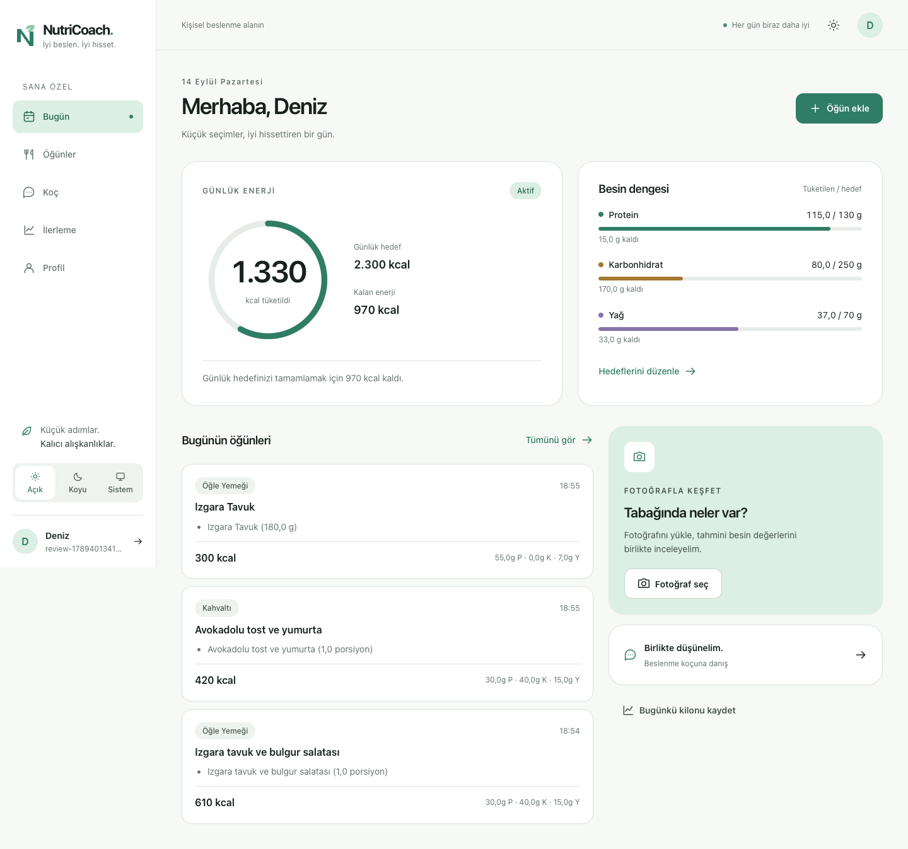
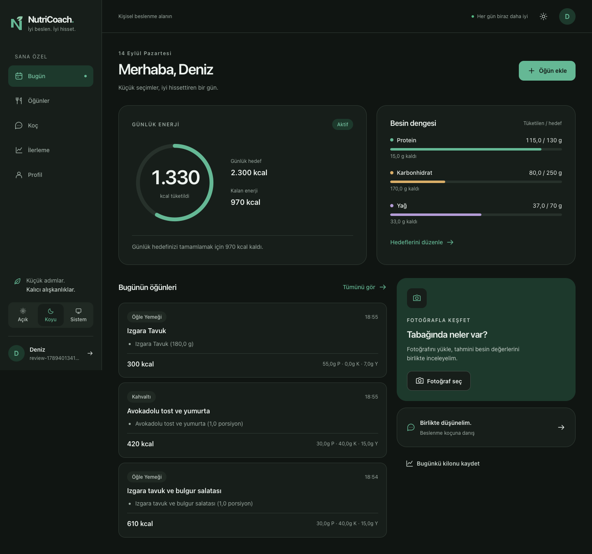
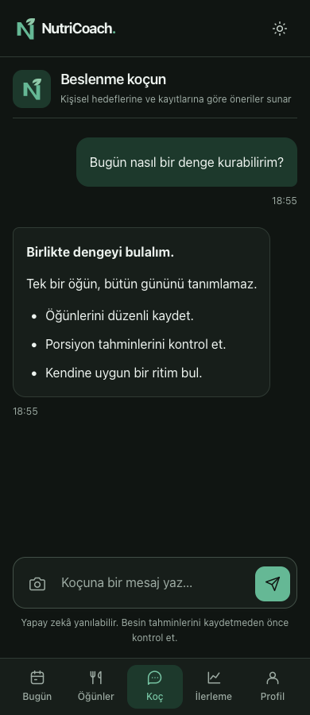

# NutriCoach UI V2

## Amaç ve kapsam

Sakin, kişisel ve okunabilir bir beslenme uygulaması. Adaçayı / zümrüt kimliği korunur; renk, yazı, aralık ve etkileşim kararları ortak bileşenlerden gelir. Arayüz dili Türkçedir. `kcal`, `kg`, `g`, e-posta, Google Arama ve NutriCoach gibi yerleşik birimler/özel adlar çevrilmez. API enum değerleri çevrilmez; kullanıcıya gösterilirken Türkçe etiketlere eşlenir.

FastAPI + Jinja2 + doğal CSS + vanilla JavaScript korunmuştur. Yeni bir frontend framework'ü, derleme zorunluluğu, harici font veya ikon CDN'i yoktur. Tarayıcıdaki Inter fontu varsa kullanılır; yoksa işletim sisteminin sans-serif fontuna geçilir. Backend iş mantığı, migration ve API sözleşmeleri bu çalışmanın kapsamı değildir.

## İlk inceleme

- Sekiz sayfa, tek `base.html`, 2.808 satırlık bir CSS ve yedi JavaScript dosyası vardı.
- Giriş ve kayıt bağımsız dokümanlar, farklı form/düğme boyutları ve tekrarlanan tema betikleri kullanıyordu.
- Masaüstü/mobil gezinme ve farklı logo çizimleri ayrı HTML parçaları olarak çoğaltılmıştı.
- Inline boyutlar, tekrarlanan seçiciler, kontrolsüz SVG boyutları ve küçük metinler ortak bir ölçek izlemiyordu.
- Çalışmayan sosyal giriş düğmeleri ve gerçek kayıt ekranını sahte bilgilerle dolduran demo eylemleri vardı.
- Sayfalar kullanıcı ve CSRF bağlamını Jinja'dan, içeriklerini `/api/v1/me` uçlarından alıyor. JS modülleri DOM kimliklerine bağlı.
- Fotoğraf kaydetme alanları mevcut `MealWrite` sözleşmesine uymuyordu. Öğün düzenleme için endpoint ve form parçaları vardı, fakat listeye bağlı bir düzenleme akışı yoktu.

Uygulama planı: önce ortak değişkenler ve bileşenler; ardından ortak kabuk/giriş formları; sonra sayfa hiyerarşisi, dinamik içerik, mobil ve erişilebilirlik; son olarak gerçek tarayıcı akışları. Mevcut çalışma ağacındaki backend değişiklikleri korunmuştur. Commit/push yapılmaz.

## Dosya mimarisi

```text
app/static/css/
  app.css                 # Yalnızca sıralı CSS importları
  tokens.css              # Tema, ölçü, tipografi, hareket değişkenleri
  base.css                # Reset, temel HTML, odak, azaltılmış hareket
  components.css          # Düğme, form, kart, rozet, modal, bildirim
  layouts.css             # Ana kabuk, sidebar, üst bar, mobil gezinme
  utilities.css           # Az sayıda tek amaçlı yardımcı sınıf
  pages/
    auth.css dashboard.css coach.css meals.css progress.css profile.css
app/templates/
  auth_base.html          # Giriş/kayıt için tek kabuk
  base.html               # Oturum açmış kullanıcı kabuğu
  components/
    head.html             # Tema başlatma + stiller + CSRF meta
    primitives.html       # icon(), brand(), field(), themes() makroları
    navigation.html       # Masaüstü/mobil için aynı route listesi
    dialogs.html          # Onay, ortak öğün düzenleyici, fotoğraf tarama
```

`api.js` tüm istekler ve CSRF ekleme işlemini korur. `ui.js` tema, bildirim, onay, tarih/sayı sunumu, güvenli metin işleme ve ortak öğün düzenleyicisini içerir. `auth.js` giriş/kayıt form davranışlarını birleştirir. `theme-init.js` stillerden önce çalışır. Diğer sayfa JS modülleri veriyi ortak bileşen sınıflarıyla sunar.

## Tasarım değişkenleri

Renk kaynağı yalnızca `tokens.css` dosyasıdır. Açık temanın ana renkleri: primary `#2F7D65`, accent `#8FC9A9`, background `#F7F9F6`, surface `#FFFFFF`. Koyu temada primary `#65B895`, background `#101512`, surface `#171E1A` kullanılır. Bütün ikincil yüzey, metin, sınır, durum ve makro renkleri de değişkendir.

`--color-on-accent` yumuşak yeşil yüzey üzerinde küçük metin için kullanılır; her yeşil metinde `--color-primary` kullanmak yeterli kontrast sağlamaz. İkincil yüzeylerde küçük metin gerekirse `--color-text-secondary` kullanır. Verilen marka paleti bu amaçla değiştirilmez.

- Aralık: 4, 8, 12, 16, 20, 24, 32, 40, 48, 64 px (`--space-*`).
- Köşe: 8, 12, 16, 24 px ve pill (`--radius-*`).
- Yazı: xs 12, sm 14, md 16, lg 18, xl 22, 2xl 28, 3xl 36 px. Başlık/ana ölçü `clamp()` ile uyarlanır.
- Ağırlık: regular 400, medium 500, semibold 600, bold 700.
- Kontrol: sm 44, md 48, lg 52 px. Dokunma hedefi en az 44 px.
- Gölge: xs/sm/md/overlay. Kartlar ağır gölge kullanmaz.
- Hareket: 140/240 ms. Grafik ilerlemesi ve tarama animasyonu yalnızca anlamlı durumlarda kullanılır; `prefers-reduced-motion` korunur.

Ham renkler sayfa CSS/JS dosyalarına eklenmez. SVG marka dosyaları ve ilk tarayıcı tema meta değeri doğal istisnalardır. Grafik geometrisi, ilerleme yüzdesi ve textarea/viewport yüksekliği gibi veriden hesaplanan değerler JS tarafından atanabilir; statik yerleşim `style` niteliğine yazılmaz.

## Yeni bileşen ekleme kuralları

### Düğme

```html
<button class="btn btn-primary btn-md">Kaydet</button>
<button class="btn btn-secondary">Vazgeç</button>
<button class="btn btn-ghost btn-icon" aria-label="Fotoğraf seç">…</button>
```

Varyantlar: primary, secondary, ghost, danger. Boyutlar: sm, md (varsayılan), lg. Aynı boyuttaki düğmeler aynı minimum yükseklik, font ve iç boşluğu kullanır. Disabled/busy durumunu işlem boyunca koru; ikon düğmesinin erişilebilir adı olmalıdır. Uzun etiketler gerektiğinde sarılır; ikonları küçülterek metne yer açma.

### Form

Yeni input için `.form-control`, kapsayıcı için `.form-field`, etiket için `.form-label` kullan. Yeni bir sayfa input sınıfı icat etme. Select/textarea aynı primitive'in `.form-select` / `.form-textarea` çeşitlerini kullanabilir. Etiketin `for` değeri input kimliğiyle eşleşmelidir. `.form-help` ve `.form-error` ile yardımcı/hata metni ekle. Hatalı alana `aria-invalid` ve gerekiyorsa `aria-describedby` bağla.

Jinja'da basit alanlar için `field(id, label, type, autocomplete, placeholder)` kullanılabilir. Giriş/kayıt kartı **aynı** `auth_base.html` üzerinden gelir, ortak genişlik 460 px, input 48 px, birincil giriş düğmesi 52 px'tir.

Form sıraları `.form-row-2/3/4` ile kurulur. Ayar grupları `fieldset.settings-fieldset` + `legend` kullanır. Kaydet eylemi uzun profil formunun sonunda yer alır; kaydedilmemiş değişiklik görünürdür. Native sayısal doğrulamada `min` ve `step` uyumlu olmalıdır: örneğin `min="0.01" step="0.01"`.

### Kart ve diğer bileşenler

- Yeni yüzey: `.card`; gerektiğinde `.card-muted`, `.card-highlight`, `.card-interactive`, `.card-danger`.
- İç bölümler: `.card-header`, `.card-body`, `.card-footer`; yatay başlık/eylem için `.card-header-flex`.
- Küçük durum: `.badge`; etkileşimli öneri: `.chip`.
- Boş içerik: `.empty-state-box`; yükleniyor: `.skeleton-card` / `.skeleton-bubble`.
- Mesaj: `.alert` + durum sınıfı veya `ui.showToast()`.
- Modal: native `<dialog class="app-dialog">` ve `.dialog-card`, `.dialog-header`, `.dialog-body`, `.dialog-actions`.
- Avatar: `.user-avatar` / `.coach-avatar`.
- Metin bağlantısı: `.link-subtle`.
- Makro: `.macro-card`, `.macro-progress-bg`, `.macro-progress-fill`; renk ilgili besin değişkeninden gelir.

Native dialog odağı ve Escape davranışı korunur. Uzun içerik yalnızca dialog gövdesinde kayar; eylemler görünür kalır. Mobilde alt kenara yerleşir ve safe-area boşluğu bırakır.

## Kabuk ve responsive davranış

- İçerik maksimum 1.200 px; sidebar 248 px, orta boy ekranlarda 216 px.
- 900 px ve altında sidebar yerine üst bar + beşli alt gezinme kullanılır. İkisi aynı Jinja navigasyon listesinden üretilir.
- 1.100–1.200 px bölgesinde sayfa sütunları daralır; dashboard 680 px altında tek sütuna geçer. Auth 800 px altında tek kart olur. 600 px altında dialog ve form düzeni mobil için değişir.
- Kontrol edilen genişlikler: **360, 390, 430, 768, 1024, 1280, 1440 px**.
- `minmax(0,1fr)`, `min-width:0` ve metin sarma temel kurallardır. İsim/e-posta yalnızca gezinmede ellipsis alır; profil ve sohbet metni kırpılmaz.
- Mobil alt gezinme yüksekliği içerik alt boşluğuna eklenir. Safe-area üst/alt değerleri ve `dvh` kullanılır. Sohbet, VisualViewport değişimine uyum sağlar.
- Grafik viewBox genişliği kapsayıcıdan hesaplanır; eksen yazıları mobilde orantısız küçülmez. Kilo eğrisinin yatay ekseni ölçümler arasında geçen zamanı yansıtır.

## Sayfalar

- **Bugün:** tek ana öğün ekleme eylemi; enerji halkası ve hedef/kalan bilgi; üç makro; öğün listesi; ayrı fotoğraf keşif alanı ve koç bağlantısı.
- **Öğünler:** tarih seçimi, kısa günlük özet, kompakt satırlar. Düzenle/sil ikincil eylemlerdir. Düzenleme ve fotoğraf sonucu aynı çoklu yiyecek düzenleyicisini kullanır.
- **Koç:** okunabilir mesaj genişliği, güvenli paragraflar/liste/kalın metin, zaman bilgisi, kaynak bağlantıları, sabit kullanılabilir yazma alanı. Model HTML'i doğrudan çalıştırılmaz. Kaynak bağlantılarında yalnızca HTTP(S) kabul edilir. HTTP 201 içindeki başarısız mesaj durumu da kullanıcıya gösterilir.
- **Fotoğraf:** yükleme sonrası gerçek istek süresince önizleme/tarama; iptal; güven yüzdesi ve uyarılar; miktar/birim/besin değerlerini düzenleme; toplam ve kaydetme. Tahminler otomatik kaydedilmez.
- **İlerleme:** kilo eğrisi, güncel/hedef kilo, haftalık kalori sütunları ve ölçüm geçmişi. Kayıtsız günler kesikli boş sütunla ayrılır; sıfır tüketim olarak yorumlanmaz.
- **Planım:** deterministik günlük hedef snapshot'ı, hesaplama kaynağı, planlanan hız/ETA ve yeniden hesaplanan beslenme girdileri.
- **Hesabım:** kimlik, saat dilimi, görünüm ve güvenlik ayarları beslenme planından ayrıdır.
- **Onboarding:** hedef, vücut, günlük hareket, antrenman ve hız için beş adımlı ilk kurulum.

## Tema ve dil

`theme-init.js`, localStorage'daki `nutricoach_theme` değerini (light/dark/system) stiller yüklenmeden çözer. `data-theme` çözümlenen temadır; `data-theme-setting` tercihtir. `ui.setTheme()` seçim, düğme ARIA durumları ve tarayıcı meta rengini günceller. Sistem değişimleri izlenir; depolama erişilemezse arayüz çalışmaya devam eder. Mobil hızlı düğme mevcut **görünen** temayı tersine çevirir.

Sayılar `tr-TR`, gün/saat kullanıcı timezone'u ile sunulur. İngilizce dil seçeneği eklenmemiştir; yarım çeviri yerine tutarlı Türkçe tercih edilmiştir. İleride dil desteği eklenirken görünür metinler merkezi sözlükte toplanmalı; API alanları ve DOM kimlikleri çevrilmemelidir.

## Temizlenen eski kod ve düzeltmeler

- Monolitik CSS, yinelenen auth CSS'i ve auth inline betikleri kaldırıldı.
- Çalışmayan Google/Apple giriş seçenekleri, demo veri doldurma ve İngilizce pazarlama metinleri kaldırıldı.
- Statik template inline stilleri kaldırıldı; dinamik öğün/hafıza metinleri HTML-escape edilir.
- Logo varyantları aynı N/yaprak geometrisinden üretildi; ortak stroke/ölçüde SVG ikon sistemi eklendi.
- Fotoğraf kaydı `occurred_at`, `original_description`, `nutrition_source`, item `source` alanlarıyla mevcut sözleşmeye uyar. Düzenleme `expected_version` taşır, öğünün zamanını korur. Ondalık besin değerleri iki basamakta tutulur.
- Negatif fotoğraf değerlerini sessizce kaydetme yerine native doğrulama engeller. “1 porsiyon” adım uyuşmazlığı düzeltildi.
- Başarısız veri yükleme, kayıt olmayan gün gibi sunulmaz.

## Doğrulama ve tekrar çalıştırma

Backend/regresyon testleri:

```sh
.venv/bin/python -m pytest -q
```

İzole tarayıcı sunucusu (ayrı terminal):

```sh
.venv/bin/python scripts/ui_v2_preview.py
```

Bu sunucu geçici SQLite kullanır, `.env` okumaz ve gerçek Gemini çağırmaz. Kapanınca test veritabanı silinir. Normal uygulama/veritabanını kullanmaz.

Tarayıcı araçlarını uygulamaya bağımlılık eklemeden kur:

```sh
npm install --prefix /tmp/nutricoach-ui-tools playwright @axe-core/playwright
/tmp/nutricoach-ui-tools/node_modules/.bin/playwright install chromium webkit
NODE_PATH=/tmp/nutricoach-ui-tools/node_modules node scripts/ui_v2_smoke.cjs
NODE_PATH=/tmp/nutricoach-ui-tools/node_modules UI_BROWSER=webkit node scripts/ui_v2_smoke.cjs
```

Yerel Chrome kullanılacaksa `CHROME_PATH` değişkenini executable yoluna ayarla. `UI_REVIEW_OUTPUT` ekran görüntülerinin/raporun dizinini seçer; verilmezse geçici dizin kullanılır. Test betiği önce sunucunun izole test işaretini doğrular; gerçek uygulamaya yanlışlıkla kayıt yazmaz.

Tarayıcı paketi: gerçek kayıt/giriş/çıkış, manual öğün ekleme, düzenleme/silme ve toplam değişimi, fotoğraf düzenleme/kaydetme, negatif/ondalık değerler, profil kaydetme, kilo kaydı, fake provider ile sohbet, kaynak görünümü ve güvenli URL, uzun ad/mesaj, tema kalıcılığı, 7 genişlikte taşma, auth boyut eşitliği ve axe WCAG A/AA taramaları.

## Tamamlanan kontrol sonuçları — 14 Eylül 2026

- Pytest: **164 passed**, 3 mevcut bağımlılık deprecation uyarısı.
- Chromium ve WebKit: her birinde **88 yerleşim/taşma kontrolü**, 7 genişlik, iki tema; geçerli.
- Her tarayıcıda 15 axe taraması (giriş/kayıt ve 5 uygulama sayfasında açık/koyu tema, ayrıca fotoğraf penceresi): **0 bildirilen WCAG A/AA ihlali**.
- İki tarayıcıda **0 JavaScript hatası, 0 konsol hatası**.
- Giriş/kayıt kart/alan/düğme boyutları bütün ölçülen genişliklerde eşit.
- Fotoğraf sonucunun 300,25 kcal olarak kaydedilmesi dahil ondalık değer kontrolü başarılı.
- Gerçek kullanıcı verisi yerine geçici test hesapları ve fake provider kullanıldı.
- Fotoğraf düğmesi dahil hızlı eylemler artık ilk veri isteklerinden önce bağlanır; yavaş bağlantıda ilk etkileşim kaybolmaz.

Makine tarafından okunabilir ölçümler: [ui-v2-validation.json](ui-v2-validation.json).

### Ekran örnekleri

Aşağıdaki ekranlar izole test verileriyle çekildi; kişisel kullanıcı verisi içermez.





## Product V2 Sprint 4 güncellemesi — 15 Eylül 2026

Bu sprint, önceki UI V2 temelini Sprint 1–3 ürün verilerine uyarladı. Ana gezinme Bugün, Öğünler, Koç, İlerleme ve Tarifler alanlarından oluşur; Beslenme Planım ile Hesap ayarları avatar/ikincil gezinmededir. Masaüstü sidebar ve mobil safe-area uyumlu beşli alt menü aynı `navigation.html` listesini kullanır. Giriş ve kayıt `auth_base.html` kabuğunu, bütün sayfalar `primitives.html` ikon/marka/form/tema makrolarını ve ortak `base.html` kabuğunu kullanır.

Tasarım kararları `tokens.css` içindeki açık/koyu renk, aralık, yazı, köşe, kontrol yüksekliği ve içerik genişliği değişkenlerinden gelir. `base.css` odak, kırılma ve azaltılmış hareket davranışını; `components.css` düğme, alan, kart, rozet, modal, yükleme/boş/hata ve toast bileşenlerini; `layouts.css` kabuğu yönetir. Sayfa dosyaları yalnızca ilgili ekranın hiyerarşisini tanımlar. Logo SVG'leri var olan N/yaprak geometrisini korur; `icons-v2.svg` ve `recipe-plate.svg` ikon/tarif görsel sözlüğünü tamamlar. Tema tercihi `ui.js` ile localStorage'a yazılır; `theme-init.js` CSS yüklenmeden önce açık/koyu/sistem kararını uygular ve sistem değişikliğini dinler.

Giriş/kayıt aynı form ölçülerini kullanır. Beş adımlı onboarding bitince backend planını özetler. Bugün sayfası günlük enerji, makro, kısa içgörüler ve en hızlı yiyecek ekleme eylemini öne alır. Öğünler sayfasında arama, Son kullanılanlar, Favoriler, özel yiyecek, Ekstra, fotoğraf ve Koç yolları korunur; porsiyon önizlemesi ve toplamlar yalnızca backend'den gelir. Koç ekranı kısa bağlam ve hızlı sorular sunar. İlerleme ekranı ham ölçüm, backend eğilimi, hedefe kalan, aktivite, tutarlılık, başarılar ve haftalık değerlendirmeyi birleştirir. Kayıtsız/kısmi günler sıfır tüketim veya güvenilir ortalama olarak sunulmaz. Tariflerde malzeme hesabı, kısmi besin değeri, uygunluk gerekçesi ve yoksa doğru boş durum görünür. Beslenme Planım hedefleri ve hariç tutulan yiyecekleri; Hesap ise kimlik, saat dilimi, tema ve güvenliği yönetir.

Manuel küçük kontrol listesi: `/login` ve `/register` ölçülerini karşılaştır; onboarding adımlarını ve plan özetini aç; `/today` üzerinde enerji/makroları gör; `/meals` arama, porsiyon önizlemesi, Son kullanılanlar/Favoriler, fotoğraf ve Koç girişlerini dene; `/coach` taslak ve gönderimi kontrol et; `/progress` kilo, aktivite ve yetersiz veri dilini oku; `/recipes` öneri veya boş durumu aç; `/profile` ve `/account` ayrımını doğrula; Hesap'ta açık/koyu/sistem temasını değiştir. Yaklaşık 390 px ve 1280 px görünümde yatay taşma, kesilmiş yazı ve kapalı modal olup olmadığına bak.

Bu Sprint 4 için yalnızca hedefli UI testleri ve 390/1280 px izole hesap tarayıcı kontrolü yapılır. Yukarıdaki 164 test, Chromium/WebKit ve axe sonuçları **14 Eylül'deki önceki UI V2 temelinin** sonucudur; Sprint 4 tam regresyon sonucu olarak okunmamalıdır. Product V2 Final QA ayrıca gerçek iPhone Safari klavye/kamera/safe-area, uzun metinler, gerçek Gemini fotoğraf/Koç akışı, kısmi tarif verisi ve erişilebilirlik taramasını doğrulamalıdır.

## Sınırlar

Gerçek Gemini ağına/modeline yapılan çağrının kalitesi bu UI testinin konusu değildir; AI ve fotoğraf akışları gerçek backend + fake provider ile doğrulanır. WebKit testi gerçek iPhone donanımı, kamera izinleri ve fiziksel klavyenin yerine geçmez. Bir sonraki manuel kabul adımı gerçek iPhone Safari'de klavye, kamera seçimi ve safe-area kontrolüdür.

Çalışma klasörü iCloud Desktop altındaysa macOS dosyaları yeniden `dataless` hâline getirebilir. Bu, sunucuda import/statik dosya beklemesine yol açan ayrı bir ortam sorunudur; UI kodunun yükleme hatasıyla karıştırılmamalıdır. Proje klasörünü Finder'da “İndirilenleri Tut / Keep Downloaded” olarak tutmak veya bulut dışındaki bir geliştirme klasöründe çalışmak tercih edilir.
